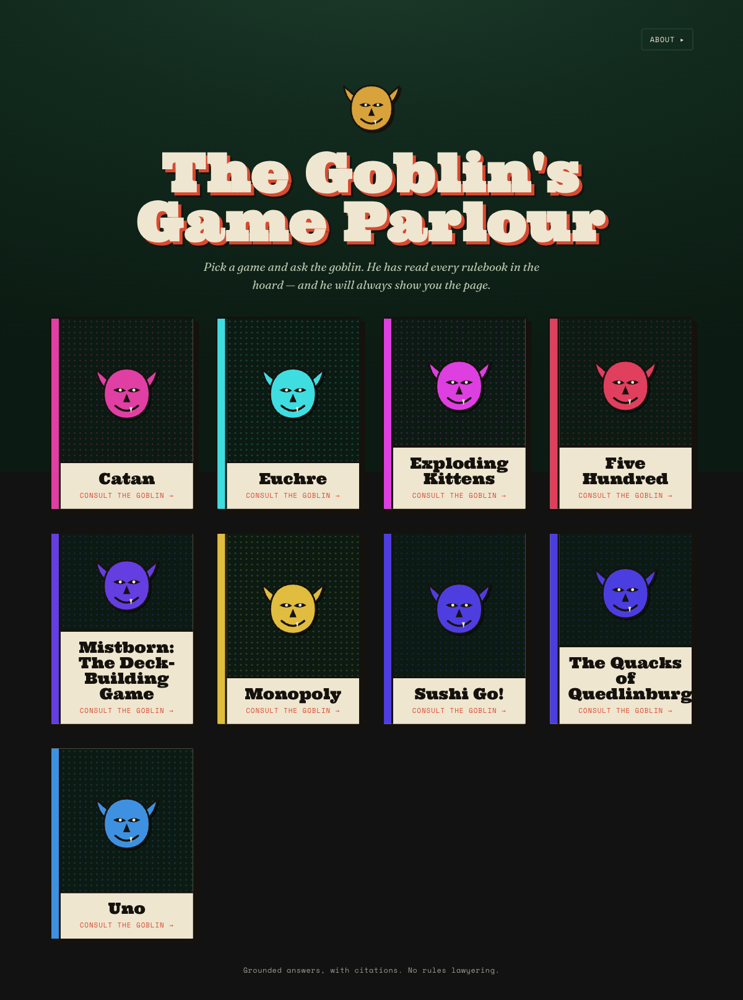

# 🎲 The Goblin's Game Parlour

[](https://github.com/jasonm4130/games-games-games/actions/workflows/ci.yml)
[](./LICENSE)
[](https://games.jasonmatthew.dev)

A Cloudflare-native **RAG-over-rulebooks** app. Pick a tabletop game and ask the Rules Goblin a
question — he answers from the *actual rulebook*, and shows you the exact passage he relied on. No
invented rules, no "I think": every ruling is grounded in the text and cited so you can check it.

**▸ Live demo: [games.jasonmatthew.dev](https://games.jasonmatthew.dev)**



## What it does

- **Grounded, cited answers.** The agent answers only from retrieved rulebook passages and returns
  citations you can open to read the source rule — anchored to the rulebook section it came from.
- **Hybrid retrieval.** Dense vector search (Vectorize) **and** lexical BM25 (D1 FTS5) are fused with
  Reciprocal Rank Fusion, then re-ranked by a cross-encoder — better recall than either leg alone.
- **Per-game isolation.** Retrieval is scoped to the selected game; each browser session is its own
  Durable Object instance (no conversation bleed between visitors).
- **A themed chat UI** — "The Goblin's Game Parlour" — with an optional spoken-ruling goblin voice
  (ElevenLabs TTS).
- **Hardened against prompt injection** (see `src/server/rag/prompt.ts`, exercised by `pnpm inject-eval`)
  and protected by per-session rate limits and a daily budget breaker.

## How it works

```
                    ┌─ offline (operator) ───────────────────────────────────┐
  rulebook PDF ──▶  Docling → clean → heading-aware chunks → bge-m3 embeddings ──▶ Vectorize + D1
                    └────────────────────────────────────────────────────────┘

                    ┌─ online (Worker / Durable Object) ─────────────────────────────────────┐
  your question ──▶ dense (Vectorize) + lexical (D1 BM25) ─▶ RRF fuse ─▶ rerank ─▶ score gate ─┐
                                                                                               │
                    cited answer  ◀── LLM (Llama 3.3 70B), grounded in the passages only ◀─────┘
                    └────────────────────────────────────────────────────────────────────────┘
```

- **Ingestion** is an offline operator step (a Worker can't parse a large PDF within its limits):
  PDFs are converted to clean markdown ([Docling](https://github.com/docling-project/docling) +
  deterministic cleanup), split into **heading-bounded** chunks so a fact never shares a chunk with
  unrelated material, embedded with `@cf/baai/bge-m3`, and written to Vectorize (vectors) + D1
  (chunk text, FTS5 mirror, metadata). See [ADR 0008](./docs/adr/0008-pdf-to-markdown-conversion.md).
- **Retrieval** runs in the Worker: the two legs are fused (RRF), re-ranked by `bge-reranker-base`,
  and gated by a score floor; the LLM is the relevance judge of last resort.
- **Citations** anchor to the rulebook **section heading** (with page fallback), so "where does it
  say that?" is one click.

The architecture decisions that are hard to reverse are written up in [docs/adr/](./docs/adr/); the
domain vocabulary lives in [CONTEXT.md](./CONTEXT.md).

## Tech stack

| Layer | Tech |
| --- | --- |
| Runtime | Cloudflare Workers + [Agents SDK](https://developers.cloudflare.com/agents/) (`agents`, `@cloudflare/ai-chat`), Durable Objects |
| Retrieval | Vectorize (dense, `bge-m3` 1024-d cosine) · D1 FTS5 (BM25) · `bge-reranker-base` |
| Generation | Workers AI (`llama-3.3-70b`) via the Vercel AI SDK v6 (`ai` + `workers-ai-provider`) |
| Storage | R2 (source files) · D1 (Drizzle ORM) · Vectorize |
| API / web | Hono · React 19 + Vite 8 (served from the same Worker via `@cloudflare/vite-plugin`) |
| Offline tooling | Python ([Docling](https://github.com/docling-project/docling)) for PDF→markdown · `tsx` operator scripts |
| Quality | Biome · Vitest (Workers pool) · `pytest` · a retrieval + generation eval harness |

## Getting started (local)

```sh
pnpm install
cp .dev.vars.example .dev.vars   # fill in what you need — all optional for a basic run
pnpm types                        # generate env.d.ts from wrangler.jsonc
pnpm dev                          # vite dev — SPA + Worker + agent with HMR
```

`pnpm dev` runs the Worker in the real `workerd` runtime locally with HMR. Note: **Vectorize and
Workers AI have no local simulation** (`remote: true`), so those calls hit a live Cloudflare account
and require `wrangler login` (and incur usage). The chat UI loads without them.

## Commands

| Command | Does |
| --- | --- |
| `pnpm dev` | SPA + Worker + agent locally with HMR |
| `pnpm build` | Vite build (client bundle + Worker) |
| `pnpm deploy` | `vite build && wrangler deploy` |
| `pnpm types` | regenerate `env.d.ts` from `wrangler.jsonc` |
| `pnpm check` | Biome (lint + format) + `tsc` |
| `pnpm test` | Vitest (Workers pool) |
| `pnpm ingest` | operator ingestion — index a rulebook's markdown (see below) |
| `pnpm eval` | retrieval (+ optional generation) eval against a gold set |
| `pnpm inject-eval` | prompt-injection eval (LLM-judged) against the hardened prompt |
| `pnpm gen-gold` | draft gold-set questions for a game |

## Operator toolchain (onboarding a rulebook)

Rulebook PDFs are copyrighted and are **not** stored in this repo (`rulebooks/` is gitignored), so
the steps below are what *the operator* runs locally to index a book they have.

```sh
# 1. PDF → cleaned markdown (Python; Docling needs no API key)
uv venv && uv pip install -e .
uv run python scripts/convert-pdfs.py --pdf ./catan-base.pdf --out rulebooks/catan/base.md

# 2. Index it. Reusing an existing --r2-key replaces that document's chunks in place (idempotent).
pnpm ingest --game "Catan" --document "Base Game" --kind base \
  --r2-key catan/base.pdf --md-path rulebooks/catan/base.md
#   [--edition "5th"] [--contextual]   (--contextual adds a Kimi situating blurb per chunk; needs MOONSHOT_API_KEY)
```

Everything rides your `wrangler login` session — no Cloudflare token to export (embeddings hit the
Workers AI REST API with a bearer pulled from `wrangler auth token`). The Python `clean.py` logic is
unit-tested with `uv run pytest scripts/lib`.

**One-time:** the Vectorize metadata indexes must exist before the first ingest —
```sh
wrangler vectorize create-metadata-index ggg-rules-index --property-name=game_id --type=string
wrangler vectorize create-metadata-index ggg-rules-index --property-name=document_id --type=string
```

## Provisioning the cloud resources

In the author's setup, the R2 bucket, D1 database, and Vectorize index are owned by a **private**
central Cloudflare Terraform repo (`../jasonm4130-cf`); this repo owns only the Worker + Durable
Object + bindings ([ADR 0003](./docs/adr/0003-terraform-wrangler-provisioning-split.md)). To run your
own fork without that repo, create the resources manually and wire the D1 id into `wrangler.jsonc`:

```sh
wrangler r2 bucket create ggg-rulebooks
wrangler d1 create ggg-db
wrangler vectorize create ggg-rules-index --dimensions=1024 --metric=cosine
./scripts/provision.sh   # wires the D1 id into wrangler.jsonc + applies the D1 migrations
pnpm deploy
```

## Layout

```
src/
  server/        Worker entry, the agent, and the RAG library
    index.ts     Hono app — routes + RulesAgent export + static SPA
    agent.ts     RulesAgent (AIChatAgent) — chat, game selection, TTS RPC
    agent-core.ts pure agent helpers (prompt assembly, citation mapping)
    rag/         chunk · retrieve · rerank · prompt · models · eval-metrics
    db/          Drizzle schema
    tts.ts       ElevenLabs goblin voice
  client/        React SPA (Catalogue · Chat · CitationModal · About)
  shared/        types shared by server + client
migrations/      D1 schema (Drizzle)
scripts/         ingest.ts · eval.ts · gen-gold.ts · injection-eval.ts · convert-pdfs.py · lib/
docs/
  adr/           architecture decision records
  superpowers/   design specs + plans
CONTEXT.md       domain glossary
CLAUDE.md        how AI agents should work in this repo
```

## For AI agents working here

Read [CLAUDE.md](./CLAUDE.md) first — working rules and the verified Cloudflare-stack gotchas.
[CONTEXT.md](./CONTEXT.md) is the domain glossary.

## License

[MIT](./LICENSE) © Jason Matthew. Game rulebooks are the property of their respective publishers and
are not included in this repository.
